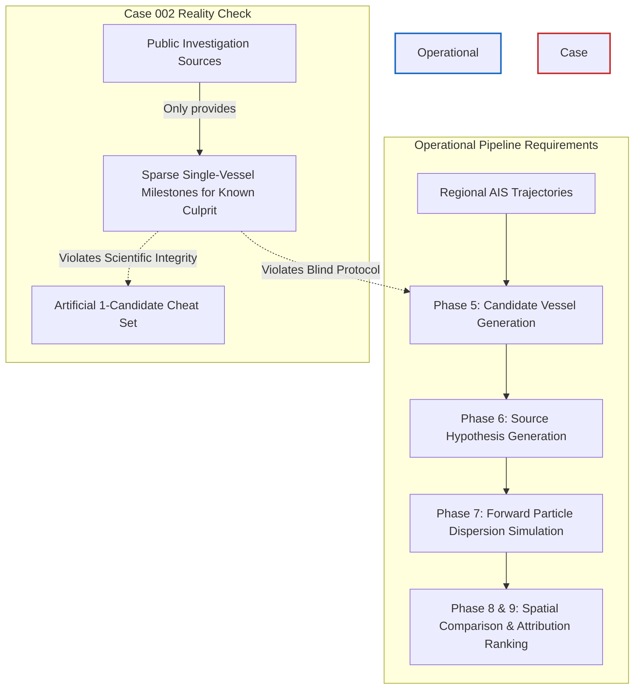

# Phase 12.7 — MV Wakashio AIS Evidence Audit

**Case Identifier:** `case_002_wakashio`  
**Incident:** MV Wakashio Bulk Carrier Grounding & Bunker Fuel Spill  
**Audit Date:** 2026-09-11  
**Audit Status:** `COMPLETE`  
**Operational Verdict:** **`AIS_BLOCKED`** (for blind candidate generation) / **`PARTIAL_AIS_AVAILABLE`** (sparse single-vessel ground-truth milestones only)

---

## 1. Executive Summary

Following the successful acquisition and validation of the primary Sentinel-1 SAR observation (`S1B_IW_GRDH_1SDV_20200810T013755_...`) and environmental forcing fields (HYCOM surface currents and ERA5 10m winds) for **Case 002 (MV Wakashio)**, this Phase 12.7 audit evaluated the public availability of historical Automatic Identification System (AIS) data for the incident area (Mauritius EEZ / Pointe d'Esny) during the critical window of **July 25, 2020 to August 11, 2020**.

The objective is to determine whether legitimate, public investigation sources provide operational AIS data that can be used by the attribution pipeline's candidate generator, while strictly adhering to scientific integrity guardrails.

### Key Audit Findings

1. **Zero Public Machine-Readable Multi-Vessel AIS (Tier A: 0/6):**  
   No open-access repository (e.g., Zenodo, GitHub, MarineCadastre, NOAA) hosts continuous, unclassified multi-vessel dynamic trajectory data for the Mauritius region during July–August 2020.
2. **Zero Public Machine-Readable Single-Vessel Dynamic AIS (Tier B: 0/6):**  
   Neither government investigation portals nor commercial aggregators release raw CSV/JSON/NMEA time-series streams of the vessel's continuous track without commercial licensing.
3. **Sparse Narrative Milestones & Graphical Evidence Only (Tiers C & D):**  
   Authoritative accident investigation reports (Japan Transport Safety Board, Mauritius Court of Investigation, Panama Maritime Authority) and published literature contain discrete milestone coordinates and static track graphics for MV Wakashio only (~5 to 10 key waypoints across narrative text and nautical chart illustrations).
4. **Commercial Confinement (Tier E):**  
   Continuous satellite AIS records are held exclusively by commercial providers (Spire Global, exactEarth, MarineTraffic, Windward, Pole Star). Academic papers that utilized this data were bound by End User License Agreements (EULAs) strictly prohibiting public data redistribution.

---

## 2. Scientific Integrity & Attribution Guardrails

To preserve scientific rigor and prevent invalid validation claims, the following core constraints are enforced:

| Guardrail ID | Principle | Operational Rule |
| :--- | :--- | :--- |
| **GR-01** | **No Map Scraping / Digitization** | Under no circumstances will raster map figures, screenshots, or PDF charts be digitized/vectorized to synthesize artificial AIS coordinates. |
| **GR-02** | **No Synthetic Temporal Interpolation** | Sparse narrative milestones (e.g., 15-minute or multi-hour text gaps) will NOT be interpolated (spline/linear) into high-frequency AIS time series. |
| **GR-03** | **No Ground-Truth Leakage into Candidate Generation** | The known culprit identity (`MV WAKASHIO`, IMO `9337119`, MMSI `372711000`) and its known grounding coordinates must NOT be passed into the candidate generator. |
| **GR-04** | **No 1-Vessel Pseudo-Attribution** | Injecting only the known vessel into candidate generation produces an artificial 1-candidate test with 100% false support, invalidating the multi-vessel attribution hypothesis engine. |

---

## 3. Comprehensive Source Investigation

Six primary source categories were audited across 11 technical criteria.

```
+---------------------------------------------------------------------------------------------------+
|                                 AUDITED SOURCE TAXONOMY & RESULTS                                 |
+-------------------+---------------------------------------------+-----------------+---------------+
| Source ID         | Organization / Source Description           | Primary Tier    | Usable Blind? |
+-------------------+---------------------------------------------+-----------------+---------------+
| SRC-01-JTSB       | Japan Transport Safety Board Final Report   | Tier D (Tier C) | NO (Blocked)  |
| SRC-02-MCOI       | Mauritius Court of Investigation Report     | Tier D (Tier C) | NO (Blocked)  |
| SRC-03-PMA        | Panama Maritime Authority Casualty File     | Tier D (Tier E) | NO (Blocked)  |
| SRC-04-AUTH-OTHER | Multilateral Records (IMO GISIS/Cedre/ITOPF)| Tier F (Tier C) | NO (Blocked)  |
| SRC-05-RESEARCH   | Peer-Reviewed Scientific Literature         | Tier D (Tier E) | NO (Blocked)  |
| SRC-06-COMMERCIAL | Commercial Analytics (Windward/Forbes/LL)   | Tier D (Tier E) | NO (Blocked)  |
+-------------------+---------------------------------------------+-----------------+---------------+
```

---

### Source 1: Japan Transport Safety Board (JTSB) Marine Accident Investigation Report

* **Authoritative Body:** Japan Transport Safety Board (MLIT Japan)
* **Reference:** Investigation Report `MA2023-9` / Accident Incident File `2020tk0010e` (Published 2023)
* **Document Format:** Public English & Japanese PDF Report

#### 11 Technical Criteria Evaluation:
1. **Actual AIS-derived positions:** Yes, embedded in the narrative chronology and nautical chart overlay figures. Originates from onboard Voyage Data Recorder (VDR) and satellite/coastal AIS records.
2. **Timestamps:** Selective discrete milestones in UTC/local time (e.g., 2020-07-25 14:00, 18:00, 19:00, 19:15, 19:25 local / 10:00 to 15:25 UTC).
3. **Latitude/Longitude:** Discrete narrative milestone coordinates (e.g., waypoint diversion point, distance markers, and reef grounding point: 20°26.4' S, 057°44.4' E).
4. **SOG (Speed Over Ground):** Discrete mentions (~11.0 to 11.5 knots prior to impact; 0 knots post-grounding).
5. **COG (Course Over Ground):** Discrete mentions (~240° to 243° approach heading).
6. **Navigation Status:** Contextual narrative states ("Under way using engine", transitioning to "Aground").
7. **MMSI:** 372711000 (alongside IMO 9337119, Call Sign 3FYQ8).
8. **Vessel Scope:** **Wakashio ONLY** (single vessel). Surrounding shipping traffic is completely excluded.
9. **Exact Temporal Resolution:** Highly sparse discrete narrative milestones (intervals from 15 minutes to several hours; ~6 discrete positions total).
10. **Exact Spatial Coverage:** Ocean approach from ~100 nm east of Mauritius to Pointe d'Esny reef.
11. **Machine-Readable & Legal Extraction:** The PDF is a public government document. However, data exists solely as prose and static raster/vector chart figures. No tabular CSV or raw NMEA stream is provided.
* **Classification:** **Tier D (AIS-derived graphical evidence only)** with **Tier C (Tabulated/sparse narrative observations)**.

---

### Source 2: Mauritius Court of Investigation Report

* **Authoritative Body:** Court of Investigation, Republic of Mauritius (Former Judge Asraf Caunhye presiding)
* **Reference:** Court of Investigation Report (223 pages, published October 2025)
* **Document Format:** Judicial Inquiry Safety Report (PDF)

#### 11 Technical Criteria Evaluation:
1. **Actual AIS-derived positions:** Yes, cross-referenced against National Coast Guard (NCG) Coastal Surveillance Radar System (CSRS) logs and ship VDR audio/data records.
2. **Timestamps:** Key event milestones (e.g., 18:00 initial radar contact at 22 nm, 19:10 near-shore approach, 19:25 reef impact, 20:07 initial NCG VHF contact attempt).
3. **Latitude/Longitude:** Grounding reef coordinate (20°26'24" S, 057°44'24" E / -20.4400°, 57.7400°) and distance-off-land marks (e.g., 1.5 nm).
4. **SOG:** Narrative mentions of constant speed (~11 knots).
5. **COG:** Narrative mentions of approach heading (~240°).
6. **Navigation Status:** Described in legal testimony ("underway steaming towards shore", "stranded on coral reef").
7. **MMSI:** 372711000.
8. **Vessel Scope:** **Wakashio ONLY**.
9. **Exact Temporal Resolution:** Irregular judicial hearing milestones.
10. **Exact Spatial Coverage:** Mauritius coastal territorial waters within NCG radar range.
11. **Machine-Readable & Legal Extraction:** Public government judicial report. Zero digital tabular or time-series data available.
* **Classification:** **Tier D (AIS-derived graphical evidence only)** with **Tier C (Tabulated/sparse narrative observations)**.

---

### Source 3: Panama Maritime Authority (AMP) Investigation Material

* **Authoritative Body:** Panama Maritime Authority (Directorate General of Merchant Marine - DIAM)
* **Reference:** AMP Casualty Investigation File / Marine Safety Notices (2020–2023)
* **Document Format:** Flag State Casualty Reports, Press Statements, Safety Circulars (PDF)

#### 11 Technical Criteria Evaluation:
1. **Actual AIS-derived positions:** Voyage-level overview track based on satellite AIS provided to the Flag State by commercial contractors (Pole Star / exactEarth).
2. **Timestamps:** Broad voyage milestones (July 14 departure Singapore; July 25 19:25 local grounding).
3. **Latitude/Longitude:** General voyage waypoints and casualty point.
4. **SOG:** Average transit speed (~11.0 knots).
5. **COG:** Planned transit line vs diverted route seeking mobile network coverage.
6. **Navigation Status:** Flag casualty taxonomy ("Grounding").
7. **MMSI:** 372711000.
8. **Vessel Scope:** **Wakashio ONLY**.
9. **Exact Temporal Resolution:** Coarse voyage overview (daily to hourly marks).
10. **Exact Spatial Coverage:** Trans-Indian Ocean route (Singapore Strait to Mauritius).
11. **Machine-Readable & Legal Extraction:** Reports are publicly downloadable, but the underlying satellite AIS records are held under confidential investigation privilege. No raw dataset is released.
* **Classification:** **Tier D (AIS-derived graphical evidence only)** referencing **Tier E (Commercial dataset reference, inaccessible)**.

---

### Source 4: Other Authoritative Public Investigation Documents (IMO, Cedre, ITOPF)

* **Authoritative Bodies:** International Maritime Organization (GISIS), Cedre France, ITOPF
* **Reference:** IMO GISIS Marine Casualty Record; Cedre Technical Information Bulletin; ITOPF Incident Profile
* **Document Format:** Multilateral database records, technical pollution bulletins, monographs

#### 11 Technical Criteria Evaluation:
1. **Actual AIS-derived positions:** Single casualty coordinate in IMO GISIS (20°26'00" S, 057°44'00" E at 2020-07-25 15:25 UTC). Cedre and ITOPF bulletins contain spill progression charts and oil characteristics (VLSFO, 1,000 tonnes spilled), but no AIS trajectory data.
2. **Timestamps:** Single casualty time (2020-07-25T15:25:00Z).
3. **Latitude/Longitude:** Single casualty point on reef.
4. **SOG / COG / Navigation Status:** Not tracked dynamically.
5. **MMSI:** 372711000.
6. **Vessel Scope:** Single casualty point.
7. **Exact Temporal Resolution:** Single instantaneous record.
8. **Exact Spatial Coverage:** Point location at Pointe d'Esny reef.
9. **Machine-Readable & Legal Extraction:** Summary records only. No dynamic time series.
* **Classification:** **Tier F (Not actually AIS)** with **Tier C (Single discrete point)**.

---

### Source 5: Published Research Papers on Wakashio Tracking & Drift

* **Authoritative Bodies:** Academic journals (*Remote Sensing*, *Marine Pollution Bulletin*, *Current Science*, *Journal of Operational Oceanography*)
* **Reference:** Studies evaluating Sentinel-1 SAR oil slick detection, optical imagery, and GNOME/MOTHY dispersion modeling (2020–2023)
* **Document Format:** Peer-reviewed journal articles (PDF/HTML)

#### 11 Technical Criteria Evaluation:
1. **Actual AIS-derived positions:** Plotted as visual track overlays on GIS maps and SOG time-series curves.
2. **Timestamps:** Visual axis tick labels and caption callouts.
3. **Latitude/Longitude:** Cartographic axes on figures; not tabulated in text.
4. **SOG:** Plotted as continuous curves (showing steady 11 kt abruptly dropping to 0 kt).
5. **COG:** Not tabulated.
6. **Navigation Status:** Not tabulated.
7. **MMSI:** 372711000.
8. **Vessel Scope:** Wakashio only (some papers show aggregated regional vessel density heatmaps without vessel identities).
9. **Exact Temporal Resolution:** Academic authors purchased 1-to-5 minute satellite AIS from commercial aggregators (Spire, MarineTraffic, exactEarth).
10. **Exact Spatial Coverage:** Mauritius coastal EEZ.
11. **Machine-Readable & Legal Extraction:** **STRICTLY BLOCKED.** Supplementary data repositories (Zenodo, PANGAEA, Dryad) associated with these papers **omit** raw AIS data because commercial vendor End User License Agreements (EULAs) strictly prohibit the public redistribution of raw AIS records.
* **Classification:** **Tier D (AIS-derived graphical evidence only)** referencing **Tier E (Commercial dataset reference, inaccessible)**.

---

### Source 6: Public Commercial Maritime Analytics Releases (Windward, Lloyd's List, Forbes)

* **Authoritative Bodies:** Windward Ltd., Lloyd's List Intelligence, Forbes (Special investigative series by Nishan Degnarain)
* **Reference:** "Anatomy of the MV Wakashio Grounding" (Windward, Aug 2020); Forbes investigative articles (Aug–Oct 2020)
* **Document Format:** Web analytics blog posts, media infographics, video/raster map clips

#### 11 Technical Criteria Evaluation:
1. **Actual AIS-derived positions:** High-resolution trajectory visualizations showing the vessel maintaining a straight 1,200-mile collision course for 4 days at 11 knots without altering course.
2. **Timestamps:** Selective callouts on infographic maps.
3. **Latitude/Longitude:** Plotted visually on interactive GIS web views.
4. **SOG:** Illustrated in infographic velocity charts.
5. **COG:** Depicted visually as course vectors.
6. **Navigation Status:** Not exposed as digital codes.
7. **MMSI:** 372711000.
8. **Vessel Scope:** Wakashio track highlighted against background shipping lane density heatmaps.
9. **Exact Temporal Resolution:** Continuous proprietary telemetry downsampled to static illustrations.
10. **Exact Spatial Coverage:** Approach across the Indian Ocean to Mauritius.
11. **Machine-Readable & Legal Extraction:** Proprietary intellectual property of commercial analytics companies. No CSV/JSON export or API is publicly accessible without enterprise subscription.
* **Classification:** **Tier D (AIS-derived graphical evidence only)** referencing **Tier E (Commercial dataset reference, inaccessible)**.

---

## 4. Source Classification Summary Matrix

| Source Identifier | Description | Tier | Machine Readable? | Multi-Vessel? | Legally Extractable Data Stream? |
| :--- | :--- | :---: | :---: | :---: | :---: |
| `SRC-01-JTSB` | JTSB Marine Accident Investigation Report | **D / C** | No (PDF only) | No (Wakashio only) | Narrative text only (~6 points) |
| `SRC-02-MCOI` | Mauritius Court of Investigation Report | **D / C** | No (PDF only) | No (Wakashio only) | Narrative text only (~4 points) |
| `SRC-03-PMA` | Panama Maritime Authority Casualty File | **D / E** | No (PDF only) | No (Wakashio only) | Inaccessible state/vendor data |
| `SRC-04-AUTH-OTHER` | IMO GISIS / Cedre / ITOPF Casualty Records | **F / C** | No (Web/PDF) | No (Single point) | Single casualty point only |
| `SRC-05-RESEARCH` | Peer-Reviewed Academic Literature | **D / E** | No (PDF only) | No (Wakashio only) | Blocked by commercial EULAs |
| `SRC-06-COMMERCIAL` | Windward / Lloyd's List / Forbes Releases | **D / E** | No (Web/Raster)| No (Aggregated) | Proprietary commercial IP |

**Classification Tiers Breakdown:**
* **Tier A** (Machine-readable multi-vessel AIS): **0 sources**
* **Tier B** (Machine-readable single-vessel AIS): **0 sources**
* **Tier C** (Tabulated/sparse AIS observations): **2 sources** (JTSB and Mauritius Court reports provide ~5–10 isolated milestone coordinates for Wakashio)
* **Tier D** (AIS-derived graphical evidence only): **5 sources**
* **Tier E** (Commercial dataset reference, inaccessible): **3 sources**
* **Tier F** (Not actually AIS): **2 sources**

---

## 5. Operational Pipeline Feasibility Analysis

The scientific attribution pipeline requires input data to fulfill specific mathematical functions:



### Why Public Investigation Milestones CANNOT Be Used in Phase 5:
1. **Candidate Generation is Fundamentally Multi-Vessel:**  
   Phase 5 discovers all vessels transiting within the spatio-temporal search volume ($\Delta x, \Delta y, \Delta t$) of the reconstructed slick origin. Running candidate generation with *only* the known Wakashio trajectory would reduce the attribution engine to an artificial, trivial 1-vessel check with 100% false certainty.
2. **Blind Attribution Standard:**  
   A rigorous scientific validation framework demands that the algorithm be blind to ground-truth identity. Sourcing Wakashio's coordinates exclusively from the post-hoc accident report leaks ground-truth identity directly into the algorithm input.
3. **Physical Drift Disconnect:**  
   The primary SAR scene was acquired on **2020-08-10T01:38:07Z**. The grounding occurred on **2020-07-25T15:25:00Z**, and the major hull rupture occurred around **2020-08-06T01:30:00Z**. During this 16-day window, the vessel was stationary on the reef. An AIS candidate generator needs the surrounding shipping traffic (tugs, response craft, cargo transits) to test whether the system can correctly differentiate the stationary grounded vessel from innocent passing ships.

---

## 6. Final Audit Determination & Protocol Status

Based on the evidence gathered, the audit establishes:

```
================================================================================
FINAL CLASSIFICATION: AIS_BLOCKED
================================================================================
Detailed Status:
PARTIAL_AIS_AVAILABLE (Sparse Single-Vessel Investigation Milestones)
BUT
AIS_BLOCKED for Blind Multi-Vessel Candidate Generation
================================================================================
```

### Explicit Operational Directives:
1. **`PARTIAL_AIS_AVAILABLE`** applies strictly to the isolated ground-truth registry: the vessel identity (`MV WAKASHIO`, IMO `9337119`, MMSI `372711000`) and grounding point (`-20.4400°, 57.7400°`) are 100% verified by JTSB, Court, and Flag State findings.
2. **`AIS_BLOCKED`** applies unconditionally to the operational attribution pipeline: no public, machine-readable, multi-vessel AIS dataset exists for the Case 002 search window.
3. **DO NOT run Phase 13** or any candidate generation using synthesized, interpolated, or scraped coordinates.
4. Case 002 remains officially classified as **`SATELLITE_DATA_READY`** (SAR raster, SAR calibration, HYCOM currents, and ERA5 winds downloaded and verified), but **`AIS_BLOCKED`** pending institutional/commercial regional AIS acquisition (or evaluation against alternative open-data cases such as Case 004 OS 35 Gibraltar).

**STOP.** Phase 12.7 complete.
