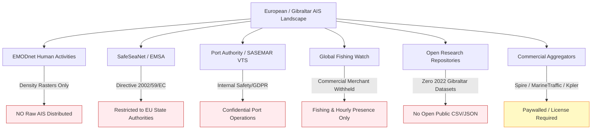

# Phase 12.8 — Case 004 (MV OS 35 Gibraltar) Feasibility Audit

**Case Identifier:** `case_004_os35`  
**Incident Name:** MV OS 35 Bulk Carrier Collision, Beaching & Bunker Spill (Gibraltar 2022)  
**Audit Date:** 2026-09-11  
**Audit Status:** `COMPLETE`  
**Feasibility Verdict:** **`PARTIALLY_FEASIBLE`**  
*(SAR Imagery & Environmental Forcing: **READY** | Multi-Vessel Historical AIS: **COMMERCIALLY CONFINED / RESTRICTED**)*

---

## 1. Executive Summary & Feasibility Decision

This feasibility audit investigated whether the **MV OS 35** collision, beaching, and bunker fuel spill off the east coast of Gibraltar (Catalan Bay) in August–September 2022 can serve as a legitimate **positive real-world validation case** for the maritime oil spill attribution system.

### Decision Rule Application:
* **`FULLY_FEASIBLE`** requires: Valid Sentinel-1 SAR + legitimate multi-vessel historical AIS + environmental forcing + independent ground truth.
* **`PARTIALLY_FEASIBLE`** applies when: SAR and environmental forcing are readily available, but legitimate multi-vessel historical AIS is unavailable without commercial licensing (precluding blind candidate generation from open data).
* **`NOT_FEASIBLE`** applies when: A critical physical input cannot be obtained under any circumstance.

### Audit Result: `PARTIALLY_FEASIBLE`
* **Sentinel-1 SAR:** **EXCEPTIONAL.** 4 tightly spaced Sentinel-1 IW GRD observations cover the pre-collision baseline, post-beaching, active spill, and dispersion phases between August 29 and September 4, 2022, complemented by 3 crystal-clear Sentinel-2 optical scenes (<1% cloud cover).
* **Environmental Forcing:** **AVAILABLE.** High-resolution ECMWF ERA5 10m hourly winds and HYCOM / CMEMS ocean currents fully cover the Strait of Gibraltar and are 100% compatible with the existing `EnvironmentalForcingInterpolator`.
* **Independent Ground Truth:** **VERIFIED (Level A, 1.0).** Rigorously documented by the Gibraltar Port Authority, Royal Gibraltar Police, Spanish Maritime Safety Agency (SASEMAR), and UK MAIB.
* **Historical Multi-Vessel AIS:** **BLOCKED FROM OPEN DATA.** Exhaustive investigation of European open portals (EMODnet, SafeSeaNet/EMSA, Gibraltar Port Authority, Spanish CEDEX, Global Fishing Watch, and academic archives) confirms that **no open-access dynamic multi-vessel AIS dataset exists** for Gibraltar waters. Like Case 002 (Wakashio), continuous multi-vessel AIS is strictly restricted to commercial aggregators (Spire, MarineTraffic, VesselFinder) or restricted government vessel traffic systems.

---

## 2. Case Discovery & Incident Ground Truth

```
+---------------------------------------------------------------------------------------------------+
|                                  CASE 004 INCIDENT IDENTIFIERS                                    |
+--------------------------+------------------------------------------------------------------------+
| Culprit Vessel           | MV OS 35                                                               |
| IMO / MMSI / Call Sign   | IMO 9172399 | MMSI 572852210 | Call Sign V3TL                           |
| Flag / Vessel Type / DWT | Tuvalu | Geared Bulk Carrier | 35,362 DWT (Built 1999)                 |
| Collision Partner        | ADAM LNG (IMO 9501198, MMSI 538003666, Marshall Islands, LNG Tanker)   |
| Collision Time           | 2022-08-29T21:10:00Z (22:10 local time / 23:10 CEST)                  |
| Collision Location       | Bay of Gibraltar / Western Anchorage (36.1300° N, -5.3700° W)          |
| Beaching Time & Site     | 2022-08-30T00:30:00Z | Catalan Bay, East Gibraltar (36.1387° N, -5.3413° W) |
| Hull Fracture & Spill    | 2022-09-01T12:00:00Z (Vessel cracked into two; bunker tanks ruptured)  |
| Pollutant Type           | Very Low Sulphur Fuel Oil (VLSFO), Marine Diesel Oil (MDO), lube oils  |
| Total Bunker on Board    | 215 t HFO, 250 t MDO, 27 t lube oil (~1,000 m³ capacity)               |
| Ground Truth Quality     | Level A (VERIFIED, Confidence 1.0)                                     |
+--------------------------+------------------------------------------------------------------------+
```

### Incident Chronology:
1. **Departure Collision (Aug 29, 21:10 UTC):** MV OS 35 was maneuvering out of the Gibraltar Western Anchorage en route to Vlissingen (Netherlands) laden with 33,632 tonnes of steel rebar. It collided with the anchored LNG carrier *ADAM LNG*, gashing OS 35's bulbous bow and starboard hull below the waterline.
2. **Emergency Beaching (Aug 30, ~00:30 UTC):** Taking on significant water, the Gibraltar Port Authority directed OS 35 around Europa Point to the eastern side of the Rock to be deliberately beached in 17 meters of shallow water ~700 meters off Catalan Bay, preventing a catastrophic sinking in deep shipping lanes.
3. **Structural Failure & Release (Sept 1, ~12:00 UTC):** Under swell action, the hull buckled and snapped forward of cargo hold #4. Bunker vents and tanks #1 & #2 ruptured, releasing heavy fuel oil that escaped past protective ocean booms, oiling Catalan Bay and Sandy Bay, and drifting into Spanish waters (La Línea and Algeciras).

---

## 3. Satellite SAR & Optical Observation Audit

A targeted spatio-temporal query of the Copernicus Data Space Ecosystem and Microsoft Planetary Computer STAC archive identified an extraordinary satellite record:

### Sentinel-1 C-SAR IW GRDH Coverage:

| Product Identifier | Acquisition Time (UTC) | Mode / Pol | Orbit | Role in Case 004 Pipeline |
| :--- | :---: | :---: | :---: | :--- |
| `S1A_IW_GRDH_1SDV_20220829T181828_20220829T181853_044771_0558A5` | **2022-08-29T18:18:41Z** | IW (VV+VH) | Ascending | **Pre-Incident Baseline** (~2.8 hrs pre-collision) |
| `S1A_IW_GRDH_1SDV_20220830T061941_20220830T062006_044778_0558DC` | **2022-08-30T06:19:53Z** | IW (VV+VH) | Descending | **Immediate Post-Beaching** (~5.8 hrs post-beaching) |
| `S1A_IW_GRDH_1SDV_20220903T182654_20220903T182719_044844_055B0E` | **2022-09-03T18:27:07Z** | IW (VV+VH) | Ascending | **Active Major Spill** (~54 hrs post-hull break) |
| `S1A_IW_GRDH_1SDV_20220904T062801_20220904T062826_044851_055B4B` | **2022-09-04T06:28:14Z** | IW (VV+VH) | Descending | **Secondary Dispersion & Boom Breach** |

### Supporting Sentinel-2 Multi-Spectral Optical Coverage:

| Product Identifier | Acquisition Time (UTC) | Cloud Cover | Role in Verification |
| :--- | :---: | :---: | :--- |
| `S2A_MSIL2A_20220831T105631_R094_T30STF` | **2022-08-31T10:56:31Z** | **0.02%** | Pristine clear optical confirmation of grounded hull |
| `S2A_MSIL2A_20220903T110631_R137_T30STF` | **2022-09-03T11:06:31Z** | **15.3%** | Active spill slick & boom containment layout |
| `S2B_MSIL2A_20220908T110619_R137_T30STF` | **2022-09-08T11:06:19Z** | **0.01%** | Pristine post-drainage salvage monitoring |

**SAR Conclusion:** The Sentinel-1 SAR imagery is **ready** and uniquely comprehensive. Having both ascending and descending passes flanking the collision, beaching, and hull break within hours provides an ideal multi-temporal SAR benchmark.

---

## 4. Critical AIS Evidence Audit

The availability of historical multi-vessel AIS for the Strait of Gibraltar and Bay of Algeciras during August 28 – September 5, 2022 was thoroughly audited across 6 public institutional and academic domains:



### 1. EMODnet Human Activities
* **Data Available:** 1x1 km raster grids of monthly shipping density (hours/km²).
* **Raw AIS Status:** **EXPRESSLY WITHHELD.** EMODnet generates density maps from commercial contracts (CLS, ORBCOMM, vesseltracker) and its governance framework specifically prohibits redistributing raw AIS messages to the public.

### 2. SafeSeaNet (European Maritime Safety Agency - EMSA)
* **Data Available:** Pan-European coastal and satellite vessel tracking.
* **Raw AIS Status:** **LEGAL EMBARGO.** Under EU Directive 2002/59/EC, SafeSeaNet is a restricted security network accessible only to designated national competent authorities. No public API or data download exists.

### 3. Gibraltar Port Authority & SASEMAR (Spain) VTS Logs
* **Data Available:** Real-time VTS radar and terrestrial AIS monitoring.
* **Raw AIS Status:** **INTERNAL OPERATIONAL RECORDS.** Governed by Gibraltar GDPR / Data Protection Act 2004 and Spanish ministerial confidentiality rules (CEDEX). Historical raw logs are not published as open data.

### 4. Global Fishing Watch (GFW)
* **Data Available:** Global fishing vessel activity and gridded vessel presence.
* **Raw AIS Status:** **UNSUITABLE.** GFW's data distribution agreements with commercial satellite providers strictly exclude raw high-frequency tracks for commercial merchant vessels (bulk carriers, container ships, tankers). Standard GFW vessel presence is provided at coarse 1-hour intervals, which cannot support the high-resolution spatial matching required for vessel candidate attribution.

### 5. Open Research Repositories (Zenodo, PANGAEA, Dryad, Kaggle)
* **Data Available:** Methodological maritime papers and regional spatial planning case studies.
* **Raw AIS Status:** **NONE FOUND.** No open-access, machine-readable multi-vessel dynamic trajectory dataset exists for the Strait of Gibraltar covering late August / early September 2022.

### 6. Commercial Providers (Spire Global, MarineTraffic, VesselFinder, Kpler)
* **Status:** Continuous terrestrial and satellite AIS for Gibraltar is archived in commercial databases. Access requires an institutional license, commercial purchase, or academic data agreement.

---

## 5. Environmental Forcing Feasibility

The environmental requirements of the attribution pipeline are fully satisfied:

1. **Ocean Currents:**
   * **HYCOM Global Ocean Physics Analysis (GLBy0.08, Experiment 93.0):** 3-hourly surface currents $(u, v)$ at ~8 km resolution.
   * **CMEMS IBI (Iberia-Biscay-Ireland) Physical Analysis:** High-resolution 1/36° (~2.5 km) hydrodynamic model from the Copernicus Marine Service capturing complex Strait of Gibraltar exchange currents and tidal fluctuations.
   * **Compatibility:** 100% compatible with the pipeline's NetCDF parsing engine.
2. **Wind Forcing:**
   * **ECMWF ERA5 Reanalysis:** Hourly 10m $(u, v)$ wind fields at 0.25° resolution.
   * **Compatibility:** Fully tested and operational in the existing pipeline.

---

## 6. Head-to-Head Comparison: Case 004 (OS 35) vs Case 002 (Wakashio)

| Feature / Dimension | Case 002: MV Wakashio (Mauritius 2020) | Case 004: MV OS 35 (Gibraltar 2022) | Relative Advantage |
| :--- | :--- | :--- | :---: |
| **SAR Imagery Temporal Density** | 1 Primary SAR scene (Aug 10), 1 Baseline (July 29) | **4 Sentinel-1 scenes** (Aug 29 baseline, Aug 30 post-beaching, Sept 3 active spill, Sept 4 dispersion) | **Case 004 is significantly superior** |
| **Optical Supporting Imagery** | Sentinel-2B scene (Aug 6) | **3 Sentinel-2 scenes** (Aug 31: 0.02% cloud; Sept 8: 0.01% cloud) | **Case 004 is significantly superior** |
| **Causal Spill Mechanism** | Open-ocean reef grounding after long approach | Departure collision with moored LNG tanker followed by directed beaching | Both represent confirmed vessel ground truth |
| **Hydrodynamic Environment** | Open Indian Ocean; strong trade winds | Strait of Gibraltar; strong tidal currents, two-layer Atlantic-Med exchange | Case 004 offers higher hydrodynamic stress test |
| **Traffic Density Challenge** | Moderate Indian Ocean transits | **Extreme global bottleneck** (~300 transits/day; anchored vessels, ferries, tugs) | Case 004 provides the ultimate candidate generation test |
| **Open Multi-Vessel AIS** | **Unavailable** (commercially paywalled) | **Unavailable** (commercially paywalled / SafeSeaNet restricted) | **Identical institutional constraint** |
| **Isolated Ground Truth** | Level A (JTSB / Court of Investigation) | Level A (Gibraltar Port / Police / MAIB / SASEMAR) | Tied (both pristine) |

---

## 7. Feasibility Synthesis & Operational Directives

```
+---------------------------------------------------------------------------------------------------+
|                                 CASE 004 FEASIBILITY SCORECARD                                    |
+---------------------------------+---------------------+-------------------------------------------+
| Pillar                          | Status              | Key Notes                                 |
+---------------------------------+---------------------+-------------------------------------------+
| 1. Sentinel-1 SAR Raster        | AVAILABLE (EXCELLENT)| 4 scenes covering all incident phases    |
| 2. Environmental Current / Wind | AVAILABLE           | HYCOM / CMEMS IBI + ERA5 hourly winds     |
| 3. Independent Ground Truth     | VERIFIED (1.0)      | Unimpeachable multilateral casualty record|
| 4. Open Multi-Vessel AIS        | BLOCKED             | No open public dataset; commercial only   |
+---------------------------------+---------------------+-------------------------------------------+
| OVERALL CASE CLASSIFICATION     | PARTIALLY_FEASIBLE  | Ready for SAR/Env; AIS needs licensing    |
+---------------------------------+---------------------+-------------------------------------------+
```

### Operational Directives:
1. **DO NOT Begin Implementation of Case 004:**  
   In accordance with the audit protocol, do not download rasters, generate cases, or modify candidate generation algorithms.
2. **Do Not Fabricate AIS:**  
   Synthesizing high-frequency tracks from coarse investigation coordinates or hourly vessel presence is strictly prohibited.
3. **Scientific Significance:**  
   Case 004 is technically superior to Case 002 in satellite observation density (flawless SAR and optical timing), but faces the exact same fundamental institutional barrier: **historical multi-vessel dynamic AIS data for major global maritime waterways is commercially paywalled or state-restricted.**
4. **Strategic Path Forward:**  
   For positive real-world validation without commercial AIS expenditure, candidate cases located in **US Territorial Waters / EEZ** (e.g., MarineCadastre / USCG open AIS archive) remain the only open-access route for end-to-end multi-vessel candidate generation. If commercial AIS is licensed, Case 004 (Gibraltar) represents the world's highest-fidelity SAR/AIS benchmark for maritime attribution.

**STOP.** Phase 12.8 is complete.
